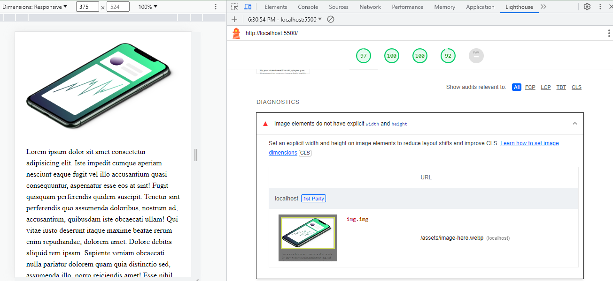
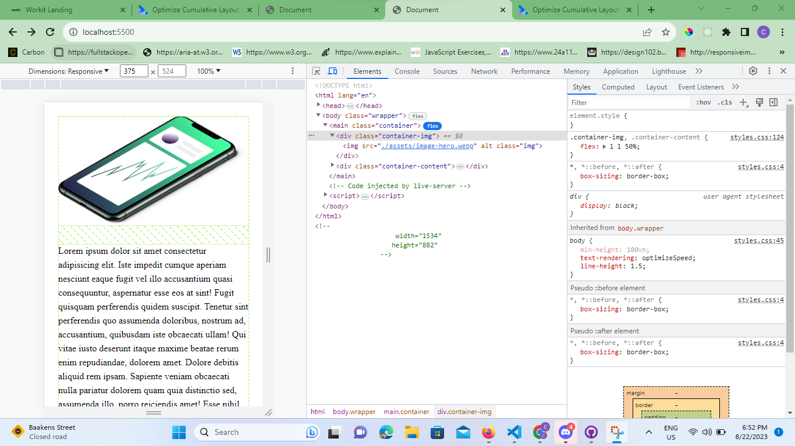
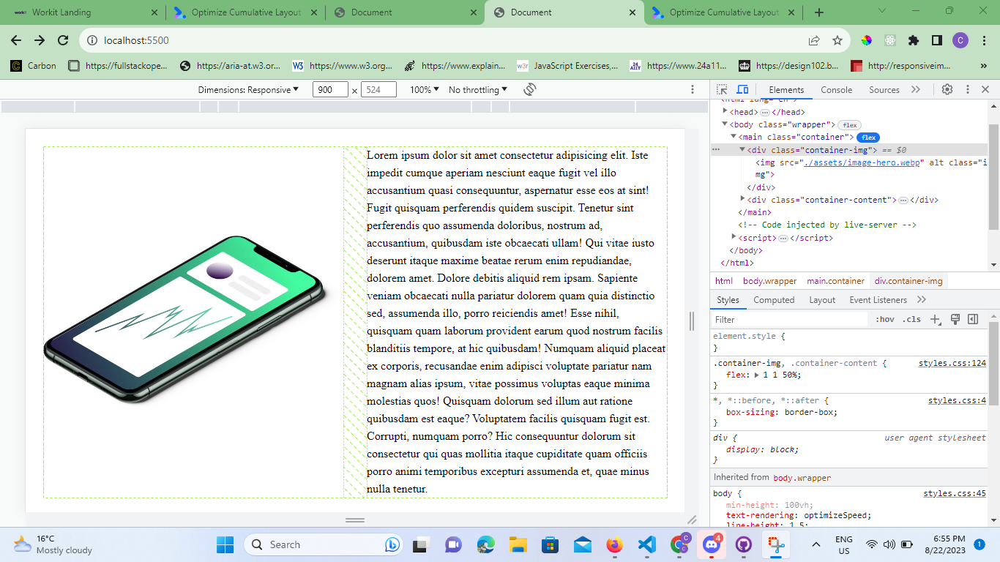
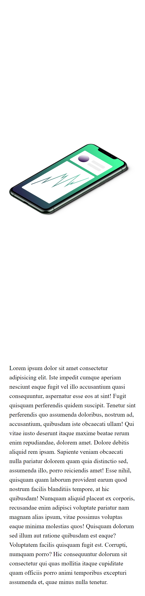
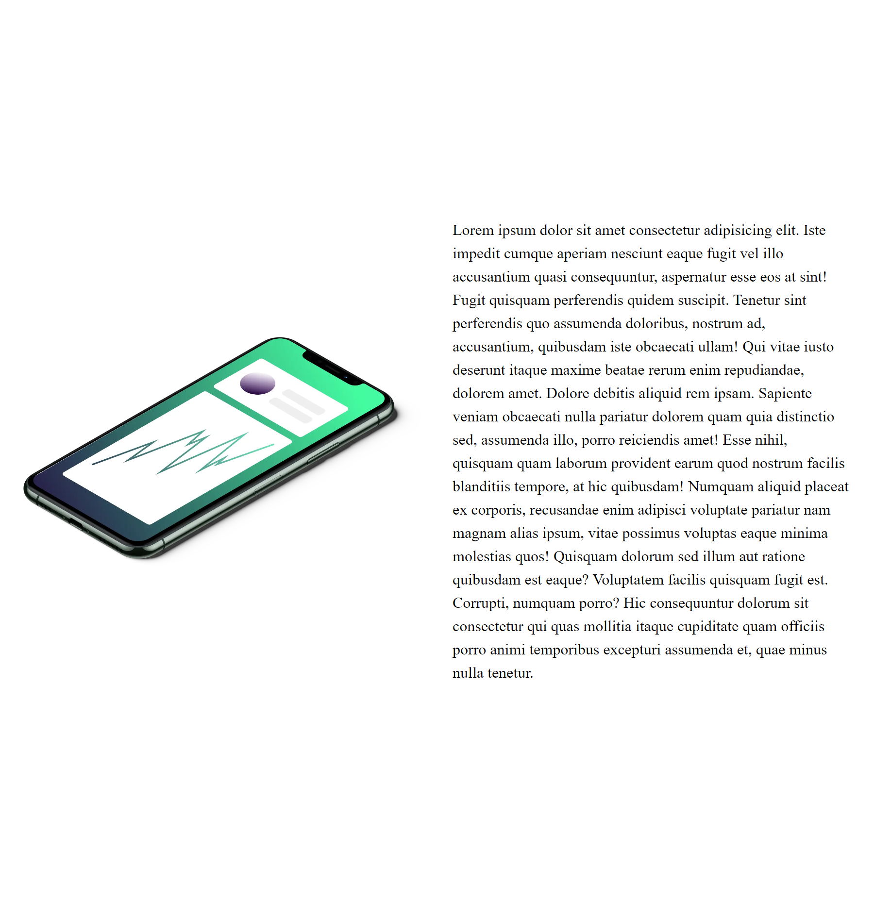
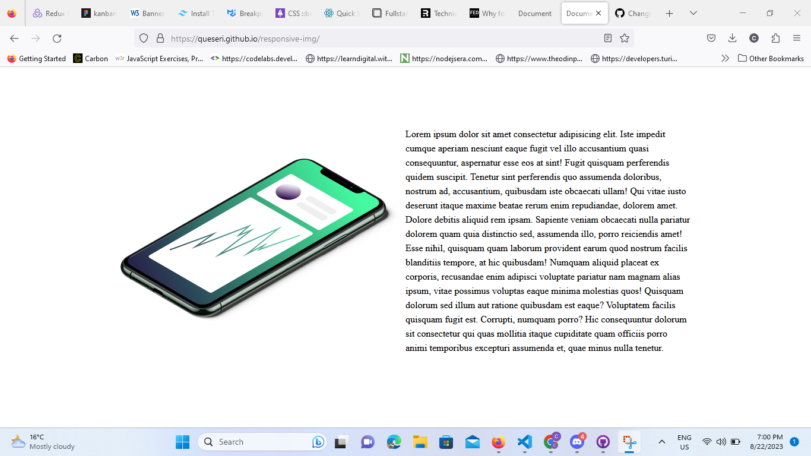

# Responsive images

## Lighthouse issue - Image elements do not have explicit width and height

- when an image is inserted in the html as in the following from the index.html ``, Lighthouse indicates that an `Image elements do not have explicit width and height`. A link for further details to the reasons why the sizes are important is given [Images without dimensions #](https://web.dev/optimize-cls/?utm_source=lighthouse&utm_medium=devtools#images-without-dimensions). The main reason behind this approach is to allow browsers to reserve the correct amount of space in the document whilst the image is loading
- the illustration is done using `display: flex` where the mobile has a column direction which is changed to row in medium to desktop.

